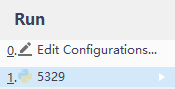

1. Unzip the .zip document to the desktop

2. Use PyCharm to open the “pythonProject” folder

3. Enter the project folder and open the main class document -- 5329.py

4. Position the Error and press "Alt + Enter" to download necessary packages automatically, such  as numpy, matplotlib, etc. (If necessary)

5. Press "Alt+shift+F10" to run the project and then click on the 5329

   

======================================================
Change model by hyperparameters: 6 or 7 or 8 or 9 and step 10

6. Momentum optimizer parameters should be set as below:
    
    model = DFN(hidden_dims_1=200,
                hidden_dims_2=10,
                optimizer="momentum(lr=0.01, momentum=0.90)"
	)
     #note: default parameters is sgd 

7. Regularizer and momentum optimizer parameters should be set as below:
	
     model = DFN(hidden_dims_1=200,
                hidden_dims_2=10,
                optimizer="momentum(lr=0.001, momentum=0.90)",
	regular_act="l2(lambd=0.001)"
                )

8. Dropout parameters and momentum optimizer parameters should be set as below:

     model = DFN(hidden_dims_1=200,
                hidden_dims_2=10,
                optimizer="momentum(lr=0.01, momentum=0.90)",
                p=0.99,
                )

9. BN parameters for trainingshould be set as below:

    model = DFN(hidden_dims_1=200,
                hidden_dims_2=10,
                optimizer="momentum(lr=0.01, momentum=0.90)",
                p=0.99,
                BN='train'
                )

10. Run the code by pressing "Alt+shift+F10" to run the project and then click on the 5329, like step 5